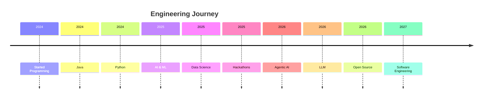

<!-- ========================================================= -->
<!--                  AKASH MOHANRAJ PROFILE                   -->
<!-- ========================================================= -->

<div align="center">


</div>

<h1 align="center">
Hi 👋 I'm Akash Mohanraj
</h1>

<h3 align="center">
Artificial Intelligence Engineer • Machine Learning • Data Science • Java Developer
</h3>

---

<p align="center">


</p>

---

<p align="center">

<a href="https://www.linkedin.com/in/akash-m-162414324/">

</a>

<a href="https://leetcode.com/u/212224230013/">

</a>

<a href="https://akash-my-portfolio.vercel.app/">

</a>

<a href="mailto:akashmohanraj333@gmaill.com">

</a>

</p>

---

# 🚀 About Me


🎓 AI & Data Science Undergraduate

💻 Passionate about Artificial Intelligence

🤖 Building AI Agents

📈 Machine Learning Enthusiast

☁ Exploring Cloud Technologies

🧠 Learning LLMs & RAG

🔥 Java Backend Developer

📚 Solving DSA every day

🏆 Hackathon Finalist

🌱 Open Source Learner

---

# 🌐 Connect With Me

<p align="center">

<a href="https://www.linkedin.com/in/akash-m-162414324/">

</a>

<a href="mailto:akashmohanraj333@gmaill.com">

</a>

<a href="https://github.com/AKASH-M-hub">

</a>

</p>

---

# 💻 Tech Stack

## Languages

<p>


</p>

---

## Frameworks

<p>


</p>

---

## AI / ML

<p>


</p>

---

## Tools

<p>


</p>

---

# 🎯 Current Focus

```text
✔ Artificial Intelligence

✔ Machine Learning

✔ Deep Learning

✔ Large Language Models

✔ Retrieval Augmented Generation

✔ Agentic AI

✔ FastAPI

✔ Java DSA

✔ System Design

✔ Open Source
```

---

# ⚡ Fun Fact

```text
I love building AI products that solve real-world problems.

Every day I learn something new and push myself to become a better engineer.
```

---
<!-- ===================================================== -->
<!--                 GITHUB ANALYTICS                      -->
<!-- ===================================================== -->

# 📊 GitHub Analytics

<div align="center">


</div>

<br>

<div align="center">


</div>

---

# 📈 Contribution Graph

<div align="center">


</div>

---

# 🏆 GitHub Trophies

<div align="center">


</div>

---

# 📌 Profile Overview

<div align="center">


</div>

---

# 🚀 Coding Activity

<div align="center">


</div>

<br>

<div align="center">


</div>

---

# 💻 Development Dashboard

<div align="center">

| Category | Status |
|----------|--------|
| 🧠 AI Engineering | ██████████ 90% |
| 🤖 Machine Learning | █████████░ 88% |
| ☕ Java | █████████░ 87% |
| 🐍 Python | ██████████ 91% |
| ⚛ React | ████████░░ 80% |
| ⚡ FastAPI | █████████░ 86% |
| 🗄 SQL | ████████░░ 82% |
| 📊 Data Science | ██████████ 90% |

</div>

---

# 🧩 Competitive Programming

<div align="center">

<a href="https://leetcode.com/u/212224230013/">


</a>

</div>

---

# 🌎 Connect Across Platforms

<div align="center">

| Platform | Link |
|----------|------|
| 💼 Portfolio | https://akash-my-portfolio.vercel.app |
| 💼 LinkedIn | https://www.linkedin.com/in/akash-m-162414324/ |
| 💻 GitHub | https://github.com/AKASH-M-hub |
| 🧩 LeetCode | https://leetcode.com/u/212224230013/ |
| 📧 Email | akashmohanraj333@gmaill.com |

</div>

---
<!-- ===================================================== -->
<!--                 FEATURED PROJECTS                      -->
<!-- ===================================================== -->

# 🚀 Featured Projects

<div align="center">

<table>

<tr>

<td width="50%">

<h3 align="center">🧠 Cogniva Enterprise Intelligence Platform</h3>

<p align="center">

Enterprise AI platform powered by FastAPI, PostgreSQL, ChromaDB, LangChain and intelligent AI Agents.

<br><br>


<br><br>

<a href="https://github.com/AKASH-M-hub">

</a>

</p>

</td>

<td width="50%">

<h3 align="center">❤️ Heart Disease Prediction</h3>

<p align="center">

Machine Learning application that predicts heart disease using multiple classification algorithms.

<br><br>


<br><br>

<a href="https://github.com/AKASH-M-hub">

</a>

</p>

</td>

</tr>

<tr>

<td width="50%">

<h3 align="center">🌦 Weather Prediction System</h3>

<p align="center">

Machine learning project predicting weather conditions with visualization dashboards.

<br><br>


<br><br>

<a href="https://github.com/AKASH-M-hub">

</a>

</p>

</td>

<td width="50%">

<h3 align="center">⚛ Quantum Entanglement Simulator</h3>

<p align="center">

Interactive simulator demonstrating quantum entanglement concepts using modern visualization.

<br><br>


<br><br>

<a href="https://github.com/AKASH-M-hub">

</a>

</p>

</td>

</tr>

</table>

</div>

---

# 🏅 Certifications

<div align="center">

| Certification | Status |
|----------------|--------|
| ☕ Oracle Java SE 21 | ✅ |
| 🤖 AI & Machine Learning | ✅ |
| 💻 HCL Campus Ambassador | ✅ |
| 🏆 Hackathon Finalist | ✅ |

</div>

---

# 🏆 Achievements

- 🚀 Built multiple AI & Machine Learning applications.
- 🏅 Hackathon Finalist.
- 🎓 AI & Data Science Undergraduate.
- ☕ Oracle Java SE 21 Certified.
- 💼 HCL Campus Ambassador.
- 🤖 Exploring Agentic AI and RAG systems.
- 📈 Actively solving Data Structures & Algorithms.

---

# 📚 Currently Learning

```text
🧠 Large Language Models (LLMs)

🤖 Agentic AI

📄 Retrieval-Augmented Generation (RAG)

☁ Cloud Computing

⚙ System Design

🐳 Docker

☸ Kubernetes

🚀 MLOps
```

---

# 💡 Areas of Interest

<div align="center">

Artificial Intelligence • Machine Learning • Deep Learning • Data Science • Computer Vision • NLP • LLMs • RAG • Agentic AI • Backend Engineering • Distributed Systems • Open Source

</div>

---

# 🎯 2026 Goals

- 🚀 Publish impactful open-source AI projects.
- 💼 Secure a Software Engineer / AI Engineer internship.
- 📚 Strengthen DSA and System Design skills.
- 🌍 Contribute to open-source communities.
- ☁ Gain cloud and MLOps expertise.
- 🤝 Build solutions that solve real-world problems.

---

# 📜 Quote

<div align="center">

> *"The best way to predict the future is to build it."*

</div>

---
<!-- ====================================================== -->
<!--                 OPEN SOURCE JOURNEY                    -->
<!-- ====================================================== -->

# 🌟 Open Source Journey

```text
2024  ██████████ Started Programming

2025  ███████████████ AI & Machine Learning Projects

2026  █████████████████ Hackathons • Open Source • AI Agents

2027  █████████████████████ Internships • Research

2028  █████████████████████████ Software Engineer
```

---

# 📈 Development Timeline



---

# ❤️ Support

If you like my work

⭐ Star my repositories

🍴 Fork Projects

🤝 Let's collaborate

---

# 📫 Reach Me

<div align="center">

<a href="mailto:akashmohanraj333@gmaill.com">


</a>

<a href="https://www.linkedin.com/in/akash-m-162414324/">


</a>

<a href="https://akash-my-portfolio.vercel.app/">


</a>

<a href="https://leetcode.com/u/212224230013/">


</a>

</div>

---

# 🐍 Contribution Snake

<p align="center">


</p>

---

<div align="center">

### 💻 "Code. Learn. Build. Repeat."


</div>
<!-- ===================================================== -->
<!--             ENGINEERING PHILOSOPHY                    -->
<!-- ===================================================== -->

# 🧠 Engineering Philosophy

> I believe software should solve real-world problems rather than simply demonstrate technical concepts.
>
> My focus is on building scalable AI-powered applications that combine intelligent decision-making, clean architecture, and an exceptional user experience.

---

# 🚀 What I'm Building

<table>

<tr>

<td width="33%">

### 🤖 AI Engineering

- Agentic AI
- LLM Applications
- RAG Systems
- AI Automation
- LangChain
- MCP

</td>

<td width="33%">

### 💻 Software Engineering

- Backend APIs
- System Design
- Authentication
- Databases
- Microservices
- REST APIs

</td>

<td width="33%">

### 📊 Data Science

- Machine Learning
- Deep Learning
- Computer Vision
- NLP
- Time Series
- Analytics

</td>

</tr>

</table>

---

# ⚙ Tech Ecosystem

<div align="center">

```text
                    +-------------------+
                    |     Frontend      |
                    | React • HTML • JS |
                    +-------------------+
                              │
                              ▼
                    +-------------------+
                    |     FastAPI       |
                    |   Backend APIs    |
                    +-------------------+
                              │
              ┌───────────────┴───────────────┐
              ▼                               ▼
      PostgreSQL                      ChromaDB

              ▼                               ▼
               AI Orchestrator (LLMs)

                        ▼

              Intelligent AI Agents

```

</div>

---

# 📈 Current Focus

```text
Building production-ready AI systems

Learning distributed system design

Mastering backend engineering

Open-source contributions

Competitive programming

Cloud-native applications
```

---

# 💼 Looking For

✔ AI Engineer Internship

✔ Machine Learning Internship

✔ Software Engineering Internship

✔ Backend Engineering Internship

✔ Open Source Collaborations

✔ Research Opportunities

---

# 🌍 Let's Build Together

If you're working on

• AI

• Machine Learning

• Open Source

• Backend Systems

• Developer Tools

I'd love to collaborate.

---

<div align="center">


</div>

<h2 align="center">

⚡ Learn Deeply • Build Consistently • Share Openly ⚡

</h2>


---