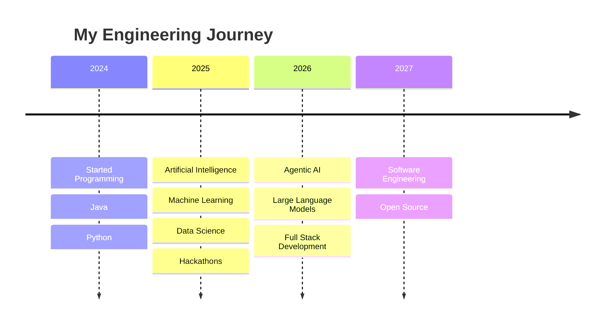

<!-- ========================================================= -->
<!--                  AKASH MOHANRAJ PROFILE                   -->
<!-- ========================================================= -->

<div align="center">


# 👋 Hi, I'm Akash Mohanraj

### 🚀 AI Engineer • Machine Learning • Data Science • Full Stack Development


</div>

---

<div align="center">

<a href="https://www.linkedin.com/in/akash-m-162414324/" target="_blank">

</a>

<a href="https://leetcode.com/u/212224230013/" target="_blank">

</a>

<a href="https://akash-my-portfolio.vercel.app/" target="_blank">

</a>

<a href="https://mail.google.com/mail/?view=cm&fs=1&to=akashmohanraj333%40gmail.com&su=Hello%20Akash&body=Hi%20Akash%2C%0A%0AI%20wanted%20to%20reach%20out%20about%20..." target="_blank">

</a>

</div>

---

# 🚀 About Me

<table>

<tr>

<td width="60%" valign="top">

🎓 **AI & Data Science Undergraduate**

💻 Passionate about **Artificial Intelligence**

🤖 Building **AI Agents & Intelligent Applications**

📈 Machine Learning Enthusiast

🧠 Exploring **LLMs & Retrieval-Augmented Generation (RAG)**

🔥 Full Stack & Java Developer

📚 Solving **Data Structures & Algorithms** every day

🏆 Hackathon Finalist

🌱 Always learning new technologies and building impactful solutions

</td>

<td width="40%" align="center">


</td>

</tr>

</table>

---


# 💻 Tech Stack

## 💡 Languages


## ⚙️ Frameworks & Databases


## 🤖 AI / Machine Learning

<div align="center">


</div>

---
# 🛠️ Tools & Technologies


---

# 🎯 Current Focus

<ul>
<li>🤖 Artificial Intelligence</li>
<li>🧠 Machine Learning</li>
<li>🔥 Deep Learning</li>
<li>📚 Large Language Models (LLMs)</li>
<li>🔍 Retrieval-Augmented Generation (RAG)</li>
<li>⚡ Agentic AI</li>
<li>🚀 FastAPI</li>
<li>☕ Java & Data Structures</li>
<li>🏗️ System Design</li>
</ul>

---

# 📈 Contribution Graph


---

# 📊 GitHub Overview


---

# 📊 Coding Activity

<div align="center">


<table>
<tr>

<td align="center">

</td>

<td align="center">

</td>

<td align="center">

</td>

</tr>
</table>

</div>

---

# 🧩 Competitive Programming

**LeetCode Profile:** [leetcode.com/u/212224230013](https://leetcode.com/u/212224230013/)

<table>
<tr>
<td width="68%" valign="top">


</td>

<td width="32%" valign="top">

- Solving DSA problems daily
- Improving contest consistency
- Practicing arrays, trees, graphs, and DP
- Tracking progress on LeetCode

</td>
</tr>
</table>

---

# 🌐 Connect Across Platforms

<p>

<a href="https://akash-my-portfolio.vercel.app/">

</a>

<a href="https://www.linkedin.com/in/akash-m-162414324/">

</a>

<a href="https://github.com/AKASH-M-hub">

</a>

<a href="https://leetcode.com/u/212224230013/">

</a>

<a href="https://mail.google.com/mail/?view=cm&fs=1&to=akashmohanraj333%40gmail.com&su=Hello%20Akash&body=Hi%20Akash%2C%0A%0AI%20wanted%20to%20reach%20out%20about%20..." target="_blank">

</a>

</p>

---

# 🚀 Featured Projects

<table>

<tr>

<td width="50%" valign="top">

## 🧠 Crowd Flow Management Prediction System

Predict crowd density using **MLP, Neural Networks & Deep Learning**.

<br>


<br><br>

<a href="https://github.com/AKASH-M-hub/crowd_flow_management_prediction_system">


</a>

</td>

<td width="50%" valign="top">

## ❤️ Silent Disease Onset Predictor

Predict health risks before symptoms appear.

<br>


<br><br>

<a href="https://health-gardian.vercel.app/">


</a>

</td>

</tr>

<tr>

<td width="50%" align="center">

## ⏳ Chrono

Trade your knowledge. Grow your skills.

<br>


<br><br>

<a href="https://chrono-barter.vercel.app/">


</a>

</td>

<td width="50%" align="center">

## ⚛️ OneLink.ai

One Link. Powered by Context.

<br>


<br><br>

<a href="https://onelinkai.vercel.app/">


</a>

</td>

</tr>

</table>


---

---


# 🌟 My Journey

```text
2024   ██████████        Started Programming

2025   ███████████████   AI • ML • Hackathons

2026   ████████████████  Full Stack • LLMs • Agentic AI

2027   █████████████████ Software Engineering Journey
```

---

# 📈 Engineering Timeline



---

# ❤️ Support My Work

<p>

If you enjoy my projects, consider supporting them by

⭐ **Starring** repositories

🍴 **Forking** projects

🤝 **Collaborating** on ideas

💬 **Sharing** feedback

</p>

---

# 🐍 GitHub Contribution Snake


---

# 🚀 What I Learn & Build

<table>

<tr>

<td width="33%" valign="top">

### 🤖 AI & ML

- Agentic AI
- LLM Applications
- Retrieval-Augmented Generation
- AI Automation
- LangChain
- Model Context Protocol (MCP)

</td>

<td width="33%" valign="top">

### 💻 Software Engineering

- Data Structures & Algorithms
- Backend Development
- REST APIs
- Authentication
- Databases
- System Design
- Microservices

</td>

<td width="33%" valign="top">

### 📊 Data Science

- Machine Learning
- Deep Learning
- Computer Vision
- Natural Language Processing
- Time Series Forecasting
- Data Analytics

</td>

</tr>

</table>

---

# 💼 Open To Opportunities

<p>


</p>

---

# 🤝 Let's Build Together

### Interested in collaborating on

🤖 Artificial Intelligence • 🧠 Machine Learning • 🌍 Open Source

⚙ Backend Engineering • 🚀 Full Stack Applications • 💡 Developer Tools

<br>

**Let's build impactful technology together.**

---


<br><br>

# ⚡ Learn Deeply • Build Consistently • Share Openly

### *"Turning ideas into intelligent solutions through code."*

<br>


